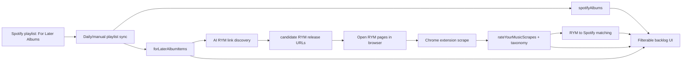
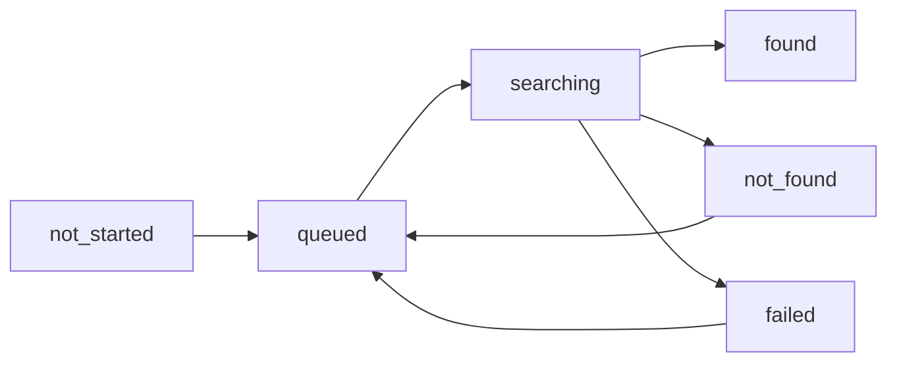

# For Later Albums PRD

## Overview

Build a "For Later Albums" workflow that turns one env-configured Spotify playlist into a ranked, filterable album backlog. The system will sync albums from that single playlist daily and on demand, enrich those albums with Rate Your Music (RYM) scrape data, and expose a UI for deciding what to listen to next.

This feature connects three existing systems: Spotify album ingestion/listen tracking, the new RYM scrape/taxonomy tables, and AI-assisted RYM release page discovery.

## Why This Work, In This Order




The order matters:

1. **Playlist ingestion first** because Spotify is the source of the backlog. Without stable rows for playlist albums, there is nothing reliable to enrich, filter, or match.
2. **Matching second** because both playlist sync and RYM scrape ingest need to opportunistically connect records as data arrives from either side.
3. **AI RYM discovery third** because the AI only needs to search for albums that have a stable Spotify row and no matched RYM scrape yet.
4. **UI last** because it depends on the unified data shape: playlist state, listen state, RYM tags, match status, and discovered links.

## Existing System Inventory

### Spotify Album Storage

Current schema in `convex/schema.ts`:

```ts
spotifyAlbums: defineTable({
	spotifyAlbumId: v.string(),
	name: v.string(),
	artistName: v.string(),
	imageUrl: v.optional(v.string()),
	releaseDate: v.optional(v.string()),
	totalTracks: v.number(),
	genres: v.optional(v.array(v.string())),
	rawData: v.optional(v.string()),
	createdAt: v.number(),
	updatedAt: v.number(),
})
	.index("by_spotifyAlbumId", ["spotifyAlbumId"])
	.index("by_createdAt", ["createdAt"]),

userAlbums: defineTable({
	userId: v.string(),
	albumId: v.id("spotifyAlbums"),
	rating: v.optional(v.number()),
	position: v.optional(v.number()),
	category: v.optional(v.string()),
	firstListenedAt: v.number(),
	lastListenedAt: v.number(),
	listenCount: v.number(),
})
	.index("by_userId", ["userId"])
	.index("by_userId_albumId", ["userId", "albumId"])
	.index("by_userId_lastListenedAt", ["userId", "lastListenedAt"]),
```

Relevant code:

- `src/lib/spotify-sync.ts` - shared recently-played sync pipeline.
- `src/lib/album-detection.ts` - album listen detection and album upsert/backfill flow.
- `convex/spotify.ts` - `upsertAlbum`, `getAlbumBySpotifyId`, `recordAlbumListen`, `getUserAlbums`, `getUserAlbumListens`, sync logs/runs.
- `src/app/albums/_context/albums-context.tsx` - existing album UI context and sync UX patterns.

### RYM Storage

Current schema in `convex/schema.ts`:

```ts
rateYourMusicScrapes: defineTable({
	rymUrl: v.string(),
	releaseKind: v.union(v.literal("album"), v.literal("ep")),
	releaseTypeLabel: v.optional(v.string()),
	albumTitle: v.string(),
	artists: v.array(
		v.object({
			name: v.string(),
			href: v.optional(v.string()),
		}),
	),
	spotifyAlbumId: v.optional(v.string()),
	spotifyAlbumUrl: v.optional(v.string()),
	spotifyAlbumConvexId: v.optional(v.id("spotifyAlbums")),
	lastScrapedAt: v.number(),
	createdAt: v.number(),
	updatedAt: v.number(),
})
	.index("by_rymUrl", ["rymUrl"])
	.index("by_spotifyAlbumId", ["spotifyAlbumId"])
	.index("by_updatedAt", ["updatedAt"]),

rateYourMusicReleaseGenres: defineTable({
	scrapeId: v.id("rateYourMusicScrapes"),
	genreId: v.id("rateYourMusicGenres"),
	role: v.union(v.literal("primary"), v.literal("secondary")),
})
	.index("by_scrapeId", ["scrapeId"])
	.index("by_genreId", ["genreId"]),
```

Relevant code:

- `convex/rateYourMusicScrapes.ts` - RYM URL normalization, scrape upsert, taxonomy sync, detail/filter queries.
- `convex/_utils/rateYourMusicTaxonomy.ts` - genre/descriptor key creation and get-or-create helpers.
- `src/app/api/rate-your-music/scrape/route.ts` - production ingest endpoint for the Chrome extension.
- `extensions/rym-release-scraper/` - local Chrome extension that scrapes RYM album/EP pages and POSTs to production.

### AI Usage

Existing AI usage is in `src/app/api/spotify/*` and uses:

```ts
import { openai } from "@ai-sdk/openai";
import { generateObject } from "ai";

const result = await generateObject({
	model: openai("gpt-5-nano-2025-08-07"),
	schema,
	system,
	prompt,
});
```

For web search, AI SDK 5 docs show OpenAI provider search via the Responses API:

```ts
import { openai } from "@ai-sdk/openai";
import { generateText } from "ai";

const result = await generateText({
	model: openai.responses("gpt-5-nano-2025-08-07"),
	prompt,
	tools: {
		web_search_preview: openai.tools.webSearchPreview({
			searchContextSize: "low",
		}),
	},
	toolChoice: { type: "tool", toolName: "web_search_preview" },
});
```

If `gpt-5-nano-2025-08-07` is not accepted by the Responses API with web search at implementation time, use the cheapest fast OpenAI Responses model that supports `web_search_preview`, but keep the model choice centralized.

## Design Decisions

### Playlist Items Are Not Listens

**Decision**: Do not store "For Later" albums in `userAlbums`.

**Rationale**:

- `userAlbums` means the user has listened to the album and has listen timestamps/counts.
- The For Later playlist is an intent/backlog list, not listening history.
- The UI still needs to show whether an album has been listened to by joining against `userAlbums` and `userAlbumListens`.

### Canonical Album Rows Stay in `spotifyAlbums`

**Decision**: Every playlist album should be upserted into `spotifyAlbums` using the same canonical album pipeline as other Spotify ingestion paths.

**Rationale**:

- Keeps album metadata centralized.
- Lets the feature reuse existing listen/rating data by album id.
- Avoids building a second album metadata table.

### There Is One For Later Playlist

**Decision**: Configure the playlist with a single server env var (`FOR_LATER_SPOTIFY_PLAYLIST_ID`). Do **not** introduce a `forLaterPlaylists` (or similar) configuration table.

**Rationale**:

- The product concept is one canonical "For Later Albums" playlist.
- A playlist config table would model multi-playlist management this product does not need.
- Env config matches existing single-user cron conventions like `SPOTIFY_SYNC_USER_ID`.
- Sync runs store the playlist id on `forLaterSyncRuns.spotifyPlaylistId` by reading the env value at run time (auditability without a config row). Backlog rows (`forLaterAlbumItems`) are scoped by `userId`; the playlist id is implicit from env for this deployment.

Server env (Next.js `src/env.js`), optional at build validation so local builds can skip it, but **production and any environment that runs playlist sync** (including dev when exercising sync routes or cron) must set it or sync cannot target a playlist:

```ts
FOR_LATER_SPOTIFY_PLAYLIST_ID: z.string().min(1).optional(),
```

### New Backlog Table Links Playlist State to Canonical Album

**Decision**: Add a feature-specific `forLaterAlbumItems` table that references `spotifyAlbums`.

**Rationale**:

- Tracks source playlist state: when an album first appeared, whether it is still present, and the track ids that caused the album to be included.
- Supports feature-specific status fields: RYM discovery status, RYM candidate URL, and match state.
- Keeps playlist-specific concepts out of generic `spotifyAlbums`.

### RYM to Spotify Matching Gets a Junction Table

**Decision**: Add `rateYourMusicSpotifyAlbumLinks` between `rateYourMusicScrapes` and `spotifyAlbums`.

**Rationale**:

- A RYM scrape can link to many canonical Spotify albums over time (re-scrapes, corrections, multiple markets); a dedicated junction models many-to-many and audit.
- `rateYourMusicScrapes.spotifyAlbumConvexId` (and optional string ids on the scrape) can remain as denormalized convenience when useful; the junction is the **source of truth** for RYM-to-Spotify album association and match provenance.
- Fields: `scrapeId`, `albumId` (`Id<"spotifyAlbums">`), optional denormalized `spotifyAlbumId` (string), `method` (`spotify_id` | `title_artist` | `manual`), optional `matchedArtistKey`, `createdAt`, `updatedAt`.
- Indexes: `by_scrapeId`, `by_albumId`, `by_spotifyAlbumId`, and `by_scrapeId_albumId` for upserts — **at most one row per (`scrapeId`, `albumId`) pair** (enforce in mutations).
- `forLaterAlbumItems.rymScrapeId` can remain a denormalized convenience for fast list rendering when the backlog cares about one primary scrape.

### Matching Is Opportunistic and Bidirectional

**Decision**: Run matching after both playlist sync and RYM scrape ingest.

**Rationale**:

- Playlist sync may ingest Spotify albums before the user has opened the RYM page.
- RYM scrape ingest may arrive before the playlist sync has seen or matched the album.
- Matching from both directions reduces manual cleanup.

### Matching Rules

**Decision**: Use a two-stage matcher:

1. Exact Spotify album id from RYM media links.
2. Normalized album title + any single artist overlap.

**Rationale**:

- RYM often exposes Spotify album ids, which should be trusted when present.
- IDs can differ by market, deluxe editions, reissues, or bad RYM media links.
- The user's requirement is one artist match, not all artists match.

### AI Discovers Candidate RYM URLs, User/Extension Confirms Data

**Decision**: AI search should find likely RYM release URLs, but the Chrome extension remains the scraper and final data source.

**Rationale**:

- Search is useful for finding pages, but the extension already has reliable DOM scraping and user-visible feedback.
- Opening the discovered page lets the user visually confirm it.
- The actual scrape still flows through the existing RYM ingest endpoint.

### Opening Many RYM Links Requires a User Gesture

**Decision**: Implement "Open N RYM links" as a user-click button that opens a capped batch of tabs, not an automatic background opener.

**Rationale**:

- Browsers block or degrade unsolicited multi-tab opening.
- A direct click handler can open multiple tabs more reliably.
- Capping batches avoids accidental tab storms.

## Proposed Data Model

### New Tables

Add to `convex/schema.ts`:

```ts
forLaterAlbumItems: defineTable({
	userId: v.string(),
	albumId: v.id("spotifyAlbums"),
	spotifyAlbumId: v.string(),

	// Search/match keys for indexed title lookup and in-memory artist overlap.
	albumTitleKey: v.string(),
	artistKeys: v.array(v.string()),

	// Playlist provenance.
	sourceTrackIds: v.array(v.string()),
	playlistAddedAt: v.optional(v.number()),
	firstSeenAt: v.number(),
	lastSeenAt: v.number(),
	removedAt: v.optional(v.number()),
	isActive: v.boolean(),

	// RYM discovery.
	rymDiscoveryStatus: v.union(
		v.literal("not_started"),
		v.literal("queued"),
		v.literal("searching"),
		v.literal("found"),
		v.literal("not_found"),
		v.literal("failed"),
	),
	rymCandidateUrl: v.optional(v.string()),
	rymCandidateConfidence: v.optional(
		v.union(v.literal("high"), v.literal("medium"), v.literal("low")),
	),
	rymDiscoveryReason: v.optional(v.string()),
	rymDiscoveryUpdatedAt: v.optional(v.number()),

	// RYM match.
	rymScrapeId: v.optional(v.id("rateYourMusicScrapes")),
	rymMatchMethod: v.optional(
		v.union(
			v.literal("spotify_id"),
			v.literal("title_artist"),
			v.literal("manual"),
		),
	),
	rymMatchedAt: v.optional(v.number()),

	createdAt: v.number(),
	updatedAt: v.number(),
})
	.index("by_userId", ["userId"])
	.index("by_userId_active", ["userId", "isActive"])
	.index("by_userId_lastSeenAt", ["userId", "lastSeenAt"])
	.index("by_userId_albumId", ["userId", "albumId"])
	.index("by_userId_spotifyAlbumId", ["userId", "spotifyAlbumId"])
	.index("by_userId_albumTitleKey", ["userId", "albumTitleKey"])
	.index("by_rymScrapeId", ["rymScrapeId"])
	.index("by_rymDiscoveryStatus", ["rymDiscoveryStatus"]),

forLaterSyncRuns: defineTable({
	userId: v.string(),
	spotifyPlaylistId: v.string(),
	source: v.union(v.literal("manual"), v.literal("cron")),
	status: v.union(v.literal("success"), v.literal("failed")),
	startedAt: v.number(),
	completedAt: v.number(),
	durationMs: v.number(),
	spotifySnapshotId: v.optional(v.string()),
	tracksFromPlaylist: v.number(),
	uniqueAlbumsFromPlaylist: v.number(),
	newAlbumsAdded: v.number(),
	existingAlbumsSeen: v.number(),
	albumsMarkedRemoved: v.number(),
	rymMatchesCreated: v.number(),
	rymDiscoveryQueued: v.number(),
	error: v.optional(v.string()),
})
	.index("by_userId_startedAt", ["userId", "startedAt"])
	.index("by_spotifyPlaylistId_startedAt", [
		"spotifyPlaylistId",
		"startedAt",
	]),

rateYourMusicSpotifyAlbumLinks: defineTable({
	scrapeId: v.id("rateYourMusicScrapes"),
	albumId: v.id("spotifyAlbums"),
	spotifyAlbumId: v.optional(v.string()),
	method: v.union(
		v.literal("spotify_id"),
		v.literal("title_artist"),
		v.literal("manual"),
	),
	matchedArtistKey: v.optional(v.string()),
	createdAt: v.number(),
	updatedAt: v.number(),
})
	.index("by_scrapeId", ["scrapeId"])
	.index("by_albumId", ["albumId"])
	.index("by_spotifyAlbumId", ["spotifyAlbumId"])
	.index("by_scrapeId_albumId", ["scrapeId", "albumId"]),
```

### Reuse Existing RYM Tables

Do not duplicate RYM genres/descriptors on `forLaterAlbumItems`. The UI should load tags through:

- `forLaterAlbumItems.rymScrapeId`
- `rateYourMusicSpotifyAlbumLinks` when resolving matched RYM scrapes from a canonical album
- `rateYourMusicReleaseGenres.by_scrapeId`
- `rateYourMusicReleaseDescriptors.by_scrapeId`
- taxonomy tables for labels.

## Core Normalization

Add helper utilities, likely `convex/_utils/albumMatching.ts`:

```ts
export function normalizeAlbumTitle(value: string): string {
	return value
		.trim()
		.toLowerCase()
		.replace(/\s+/g, " ")
		.replace(/\s+\((deluxe|explicit|clean|remaster(ed)?|bonus).*\)$/i, "");
}

export function normalizeArtistName(value: string): string {
	return value.trim().toLowerCase().replace(/\s+/g, " ");
}

export function artistKeysIntersect(a: string[], b: string[]): string | null {
	const left = new Set(a.map(normalizeArtistName));
	for (const key of b.map(normalizeArtistName)) {
		if (left.has(key)) {
			return key;
		}
	}
	return null;
}
```

Implementation note: do not over-normalize initially. The user explicitly trusts RYM taxonomy strings. For album/artist matching, trim/lowercase/whitespace normalization is the baseline; title suffix cleanup should be conservative and unit-tested.

## Matching Algorithm

### Match Spotify Album to RYM

Function signature:

```ts
export async function matchRymForForLaterAlbum(
	ctx: MutationCtx,
	args: {
		userId: string;
		forLaterAlbumItemId: Id<"forLaterAlbumItems">;
		spotifyAlbumId: string;
		albumTitleKey: string;
		artistKeys: string[];
		now: number;
	},
): Promise<{
	scrapeId?: Id<"rateYourMusicScrapes">;
	method?: "spotify_id" | "title_artist";
	matchedArtistKey?: string;
}>;
```

Order:

1. Query `rateYourMusicScrapes.by_spotifyAlbumId` for exact Spotify album id.
2. If found, upsert `rateYourMusicSpotifyAlbumLinks` for `(scrapeId, albumId)` with `method: "spotify_id"`.
3. If no ID match, query candidate RYM scrapes by a new index if added (`albumTitleKey`) or scan recent scrapes in early implementation.
4. Compare title key equality and artist key intersection.
5. If matched, upsert `rateYourMusicSpotifyAlbumLinks` with `method: "title_artist"` and `matchedArtistKey`.
6. Patch `forLaterAlbumItems.rymScrapeId`, `rymMatchMethod`, `rymMatchedAt`, and `rateYourMusicScrapes.spotifyAlbumConvexId` as denormalized convenience fields after the junction row is written.

### Match RYM Scrape to For Later Albums

On `upsertRateYourMusicScrape`, after taxonomy sync:

```ts
export async function matchForLaterAlbumsForRymScrape(
	ctx: MutationCtx,
	args: {
		scrapeId: Id<"rateYourMusicScrapes">;
		spotifyAlbumId?: string;
		albumTitle: string;
		artists: Array<{ name: string }>;
		now: number;
	},
): Promise<number>;
```

Order:

1. If RYM payload has `spotifyAlbumId`, find matching canonical `spotifyAlbums.by_spotifyAlbumId`.
2. Upsert `rateYourMusicSpotifyAlbumLinks` for exact ID matches.
3. Patch any `forLaterAlbumItems.by_userId_spotifyAlbumId` rows for `SPOTIFY_SYNC_USER_ID` / the current personal user.
4. If no exact ID match, use title key + any single artist overlap against For Later backlog items first.
5. For title/artist matches, upsert `rateYourMusicSpotifyAlbumLinks` and patch matching `forLaterAlbumItems`.
6. Patch `rateYourMusicScrapes.spotifyAlbumConvexId` when there is a single confident canonical album match.

Implementation assumption: this remains a personal single-user app. Use `SPOTIFY_SYNC_USER_ID` as the user scope for For Later matching unless a future multi-user requirement appears.

## AI RYM Release Discovery

### Purpose

Find likely RYM release pages for playlist albums so the UI can provide links to open in the browser. The extension does the actual scrape after the page is opened.

### API Shape

Add a Next API route:

```ts
// src/app/api/for-later-albums/find-rym-links/route.ts
export async function POST(request: NextRequest): Promise<NextResponse>;
```

Request:

```ts
type FindRymLinksRequest = {
	userId: string;
	albumItemIds?: string[];
	limit?: number;
};
```

Response:

```ts
type FindRymLinksResponse = {
	processed: number;
	found: number;
	failed: number;
	results: Array<{
		albumItemId: string;
		status: "found" | "not_found" | "failed";
		rymUrl?: string;
		confidence?: "high" | "medium" | "low";
		reason?: string;
	}>;
};
```

### AI Output Schema

```ts
const rymReleaseSearchResultSchema = z.object({
	status: z.enum(["found", "not_found"]),
	rymUrl: z.string().url().optional(),
	confidence: z.enum(["high", "medium", "low"]).optional(),
	reason: z.string().max(500),
});
```

### AI Call Pattern

```ts
const result = await generateObject({
	model: openai.responses("gpt-5-nano-2025-08-07"),
	schema: rymReleaseSearchResultSchema,
	system:
		"Find the canonical Rate Your Music release page for the Spotify album. Return only album or EP release pages, never artist pages, charts, reviews, lists, or single releases.",
	prompt: buildRymReleaseSearchPrompt(album),
	tools: {
		web_search_preview: openai.tools.webSearchPreview({
			searchContextSize: "low",
		}),
	},
	toolChoice: { type: "tool", toolName: "web_search_preview" },
});
```

Search prompt should include:

- Album title.
- All known Spotify artist names.
- Spotify release date/year.
- Spotify album URL if available.
- Required URL shapes:
  - `https://rateyourmusic.com/release/album/...`
  - `https://rateyourmusic.com/release/ep/...`
- Explicitly reject:
  - `/release/single/...`
  - `/artist/...`
  - `/charts/...`
  - non-RYM URLs.

### Discovery Lifecycle

`forLaterAlbumItems.rymDiscoveryStatus` transitions:




The `queued` state is for explicit user-triggered batches (Find RYM links / retries), not for playlist or cron sync.

Retry rules:

- Manual retry from UI for `failed` or `not_found`.
- Batch route should cap work, default `limit = 10`, max `25`.
- Store `rymDiscoveryReason` for why the model picked the URL or failed.

## Spotify Playlist Sync

### API Routes

Add:

```ts
// src/app/api/for-later-albums/sync/route.ts
export async function POST(request: NextRequest): Promise<NextResponse>;
```

Request:

```ts
type SyncForLaterAlbumsRequest = {
	userId: string;
	source?: "manual" | "cron";
};
```

Add cron route if desired:

```ts
// src/pages/api/cron/sync-for-later-albums.ts
export default async function handler(req: NextApiRequest, res: NextApiResponse);
```

### Spotify Fetch Behavior

Use Spotify playlist items endpoint:

```ts
GET https://api.spotify.com/v1/playlists/{playlist_id}/tracks
```

Required fields:

- `items.added_at`
- `items.track.id`
- `items.track.name`
- `items.track.album.id`
- `items.track.album.name`
- `items.track.album.artists`
- `items.track.album.images`
- `items.track.album.release_date`
- `items.track.album.total_tracks`
- `snapshot_id`

Important detail: Spotify playlists contain tracks, not album objects. The sync should infer the album from each track row and dedupe by `track.album.id`.

### Sync Steps

1. Read `FOR_LATER_SPOTIFY_PLAYLIST_ID` from server env; refuse or no-op with a clear error if unset (sync requires it).
2. Fetch playlist tracks page by page.
3. Build unique album map by Spotify album id.
4. For each unique album:
  - Call existing Spotify album fetch if playlist row is partial.
  - Upsert into `spotifyAlbums` via `api.spotify.upsertAlbum`.
  - Optionally call `api.spotify.backfillTracksFromAlbum`.
  - Upsert `forLaterAlbumItems` with playlist provenance and match keys.
  - Run `matchRymForForLaterAlbum`.
  - Do **not** enqueue AI RYM discovery from sync; the user triggers **Find RYM links** from the UI (or the Phase 3 API) when they want lookups.
5. Mark previously active items missing from the new snapshot as `isActive: false`, `removedAt: now`.
6. Write `forLaterSyncRuns`.
7. Show last sync state by querying the latest `forLaterSyncRuns.by_userId_startedAt` row.

### Function Signatures

Convex module:

```ts
// convex/forLaterAlbums.ts
export const upsertForLaterAlbumItem = mutation({ ... });
export const markForLaterAlbumsRemoved = mutation({ ... });
export const getForLaterAlbumsPage = query({ ... });
export const getForLaterLastSync = query({ ... });
export const saveForLaterSyncRun = mutation({ ... });
export const patchForLaterRymDiscovery = mutation({ ... });
export const manuallyLinkRymScrape = mutation({ ... });
```

Server utilities:

```ts
// src/lib/for-later-albums-sync.ts
export async function syncForLaterAlbums(args: {
	accessToken: string;
	userId: string;
	source: "manual" | "cron";
}): Promise<ForLaterSyncResult>;
```

## UI Requirements

### Route

Add a new route:

```txt
src/app/for-later-albums/page.tsx
src/app/for-later-albums/_components/
src/app/for-later-albums/_utils/
```

Use the **frontend design skill** when implementing row/card UI for album list items.

### Header

Show:

- Page title: "For Later Albums".
- Active playlist name.
- Last sync timestamp.
- Sync status/error if last sync failed.
- **Sync now** button.
- **Find RYM links** button for visible/unmatched albums.
- **Open RYM links** button for albums with candidate links and no scrape.

### List Ordering and Pagination

Default sort:

1. `lastSeenAt` descending.
2. `playlistAddedAt` descending.
3. `createdAt` descending.

Use Convex pagination for the main list.

### Row Content

Each album row should show:

- Cover image.
- Album title.
- Artist names.
- Spotify release year/date.
- Playlist added/first seen date.
- Whether the album is still active in the playlist.
- Whether the user has listened before.
- Listen count and last listened date if available.
- RYM status:
  - matched scrape
  - candidate URL found but not scraped
  - searching
  - not found
  - failed
  - not started
- RYM link button if candidate or matched URL exists.
- Primary genres.
- Secondary genres.
- Descriptors.
- Optional match method badge: `spotify_id`, `title_artist`, `manual`.

### Filters

Filters must support:

- Genre (primary, secondary, or either).
- Descriptor.
- Album title search.
- Artist name search.
- Release year.
- Listened before:
  - all
  - listened
  - not listened
- RYM scrape status:
  - has scrape
  - no scrape
  - has candidate URL
  - no candidate URL
- Playlist active:
  - active only
  - removed only
  - all

Implementation note: genre/descriptor filters can use existing RYM taxonomy queries, but the list query will need to intersect matching `scrapeId`s with `forLaterAlbumItems.rymScrapeId`. For first version, perform this intersection in Convex with indexed lookups and a capped page. If filters become slow, add denormalized tag keys on `forLaterAlbumItems` or a dedicated search projection table.

### Open Many RYM Links

Button behavior:

- Open only candidate/matched RYM URLs for currently filtered rows.
- Default cap: 10 tabs per click.
- User can choose batch size: 5, 10, 20.
- Use direct `window.open(url, "_blank", "noopener,noreferrer")` inside the click handler.
- Mark nothing as scraped until the extension actually posts the scrape.

Acceptance rule: opening links should never happen automatically after sync or AI discovery.

## Phases

## Phase 1: Env Config and Sync Storage

**Goal**: Use one env-configured For Later playlist and persist album backlog rows.

**Why First**: Every later phase needs stable `forLaterAlbumItems` rows.

### User Stories

- **US1.1**: As a user, the app syncs the one canonical For Later Albums playlist configured in server env.
- **US1.2**: As a user, I can sync the playlist and see albums from it in the app.
- **US1.3**: As a user, I can see when an album was first/last seen in the playlist.

### Technical Tasks

- Add `FOR_LATER_SPOTIFY_PLAYLIST_ID` to `src/env.js` (set in prod and in dev when testing sync).
- Add `forLaterAlbumItems`, `forLaterSyncRuns`, and `rateYourMusicSpotifyAlbumLinks` to `convex/schema.ts`.
- Add `convex/forLaterAlbums.ts` with item upsert, removal marking, sync-run mutations, and match lookups.
- Add `src/lib/for-later-albums-sync.ts`.
- Add `src/app/api/for-later-albums/sync/route.ts`.
- Reuse Spotify connection/access-token patterns from existing album sync.
- Reuse `api.spotify.upsertAlbum` so canonical album storage stays consistent.

### Acceptance Criteria

- Manual sync ingests a playlist with multiple tracks from the same album as one album row.
- Re-running sync updates `lastSeenAt` without duplicating rows.
- Removing an album from the playlist marks the backlog item inactive instead of deleting it.
- Sync run stats show total tracks, unique albums, new albums, existing albums, and removed albums.

## Phase 2: Bidirectional RYM Matching

**Goal**: Link Spotify backlog albums to RYM scrapes when data arrives from either side.

**Why Second**: Matching should happen before UI and AI search so the system does not search for already matched pages.

### User Stories

- **US2.1**: As a user, when RYM and Spotify share the same Spotify album id, the backlog item links automatically.
- **US2.2**: As a user, when Spotify ids differ, a matching album title and one matching artist is enough to link records.
- **US2.3**: As a user, if I scrape a RYM page after playlist sync, the existing backlog item updates automatically.

### Technical Tasks

- Add matching helpers in `convex/_utils/albumMatching.ts`.
- Add `matchRymForForLaterAlbum` to playlist item upsert flow.
- Add `matchForLaterAlbumsForRymScrape` after `upsertRateYourMusicScrape` taxonomy sync.
- Patch `rateYourMusicScrapes.spotifyAlbumConvexId` when a confident match is found.
- Add unit tests for title/artist normalization and one-artist overlap.

### Acceptance Criteria


| Scenario                                                           | Expected outcome                                 |
| ------------------------------------------------------------------ | ------------------------------------------------ |
| RYM scrape has same `spotifyAlbumId` as Spotify album              | Match method `spotify_id`                        |
| RYM scrape has no Spotify id but same title and one artist overlap | Match method `title_artist`                      |
| Two artists on Spotify, one artist on RYM                          | Match succeeds if one normalized artist matches  |
| Same title, no artist overlap                                      | No automatic match                               |
| RYM single URL                                                     | Rejected by existing RYM release-kind validation |


## Phase 3: AI RYM Link Discovery

**Goal**: Find likely RYM release URLs for unmatched backlog albums.

**Why Third**: AI should only run after we have stable backlog rows and automatic matching has already removed easy cases.

### User Stories

- **US3.1**: As a user, I can ask the app to find RYM links for unmatched albums.
- **US3.2**: As a user, I can see whether the app found a likely RYM page.
- **US3.3**: As a user, I can retry failed or not-found searches.

### Technical Tasks

- Add `src/app/api/for-later-albums/find-rym-links/route.ts`.
- Use AI SDK with `gpt-5-nano-2025-08-07` and OpenAI web search if supported.
- Store candidate URL, confidence, reason, and status on `forLaterAlbumItems`.
- Validate returned URLs with the same RYM release URL rules as scrape ingest.
- Reject `/release/single/`, `/artist/`, `/charts/`, and non-RYM URLs.
- Add retry behavior for `failed` and `not_found`.

### Acceptance Criteria

- AI discovery only processes active items with no matched `rymScrapeId` unless explicitly retried.
- Returned URLs are album/EP release URLs on `rateyourmusic.com`.
- A found candidate does not count as a scrape until the extension ingests the page.
- Failures are visible per album row and can be retried.

## Phase 4: Filterable For Later UI

**Goal**: Provide the user-facing backlog view for deciding what to listen to next.

**Why Fourth**: The UI needs playlist rows, listen status, RYM matches, taxonomy tags, and candidate links.

### User Stories

- **US4.1**: As a user, I can see the most recently added playlist albums first.
- **US4.2**: As a user, I can sync now and see the last sync timestamp.
- **US4.3**: As a user, I can filter by RYM genre, descriptor, title, artist, year, and listened status.
- **US4.4**: As a user, I can see primary/secondary genres and descriptors on each row.
- **US4.5**: As a user, I can open one or many RYM links from a filtered set.

### Technical Tasks

- Add `src/app/for-later-albums/page.tsx`.
- Add row/list/filter components under `src/app/for-later-albums/_components/`.
- Use frontend-design skill before implementing album row visual design.
- Add Convex paginated query for list rows.
- Join listen status from `userAlbums`/`userAlbumListens`.
- Add filter controls and URL state for repeatable filtered views.
- Add action buttons for sync, AI discovery, open RYM links, retry discovery.

### Acceptance Criteria

- Default list shows active playlist albums ordered newest first.
- Each row indicates whether it has a matched RYM scrape.
- Each row with a scrape shows primary genres, secondary genres, and descriptors.
- List can be filtered to albums not listened to yet.
- Genre and descriptor filters only show albums with matching RYM tags.
- Pagination works with filters applied.
- Multi-open button opens only capped batches from the current filter result.

## Phase 5: Daily Automation and Observability

**Goal**: Keep the backlog current without manual sync.

**Why Fifth**: Automation should run after manual sync and core data integrity are proven.

### User Stories

- **US5.1**: As a user, the For Later playlist syncs daily.
- **US5.2**: As a user, I can see if the last daily sync failed.

### Technical Tasks

- Add cron route `src/pages/api/cron/sync-for-later-albums.ts`.
- Add `vercel.json` cron schedule.
- Use `CRON_SECRET` and `SPOTIFY_SYNC_USER_ID` like existing cron routes.
- Refresh Spotify access token when needed using existing connection flow.
- Cron and manual sync must **not** enqueue or invoke AI RYM discovery; that stays Phase 3 manual/UI-only until explicitly changed.

### Acceptance Criteria

- Cron sync writes `forLaterSyncRuns`.
- Last sync timestamp updates on success.
- Failure message is visible in UI.
- Daily sync does not duplicate backlog items.
- Daily sync does not mark old rows inactive unless the playlist snapshot confirms they are missing.
- Sync runs leave `rymDiscoveryStatus` unchanged except where Phase 2 matching applies (no auto-queue for AI discovery).

## File Locations


| Component                     | Path                                                   |
| ----------------------------- | ------------------------------------------------------ |
| New Convex schema             | `convex/schema.ts`                                     |
| For Later Convex functions    | `convex/forLaterAlbums.ts`                             |
| Matching helpers              | `convex/_utils/albumMatching.ts`                       |
| Spotify playlist sync utility | `src/lib/for-later-albums-sync.ts`                     |
| Manual sync route             | `src/app/api/for-later-albums/sync/route.ts`           |
| AI RYM discovery route        | `src/app/api/for-later-albums/find-rym-links/route.ts` |
| Daily cron route              | `src/pages/api/cron/sync-for-later-albums.ts`          |
| UI page                       | `src/app/for-later-albums/page.tsx`                    |
| UI components                 | `src/app/for-later-albums/_components/`                |
| UI utilities/types            | `src/app/for-later-albums/_utils/`                     |
| Existing RYM ingest           | `src/app/api/rate-your-music/scrape/route.ts`          |
| Existing RYM Convex module    | `convex/rateYourMusicScrapes.ts`                       |
| Existing extension            | `extensions/rym-release-scraper/`                      |


## Test Scenarios


| Scenario                                          | Expected outcome                                                |
| ------------------------------------------------- | --------------------------------------------------------------- |
| Playlist contains 10 tracks from 10 unique albums | 10 active `forLaterAlbumItems`                                  |
| Playlist contains 3 tracks from the same album    | 1 active `forLaterAlbumItems` with multiple `sourceTrackIds`    |
| Album already exists in `spotifyAlbums`           | Reuse existing album row                                        |
| Album is newly seen                               | Insert `spotifyAlbums`, insert `forLaterAlbumItems`             |
| Album disappears from playlist                    | Patch `isActive: false`, set `removedAt`                        |
| RYM scrape has matching Spotify id                | Link automatically                                              |
| RYM scrape title and one artist match             | Link automatically                                              |
| AI returns a single release URL                   | Reject and mark `not_found` or `failed`                         |
| User clicks Open 10 RYM links                     | Browser opens at most 10 tabs from current filter               |
| User filters by descriptor                        | Only albums whose matched RYM scrape has that descriptor appear |
| User filters not listened                         | Albums with no `userAlbums` row appear                          |


## Open Questions

- Confirm `FOR_LATER_SPOTIFY_PLAYLIST_ID` is set in each deployed environment that runs sync.
- Should removed playlist albums remain visible by default or only behind an "include removed" filter?
- **Resolved:** AI RYM discovery is **manual only** (UI / Phase 3 route) for now; daily cron does not trigger it.
- Should title+artist matching apply globally to all `spotifyAlbums`, or only to For Later backlog items?
- Should ambiguous AI candidates require manual confirmation before appearing as a link?
- What batch size should the multi-open button default to: 5, 10, or 20?

