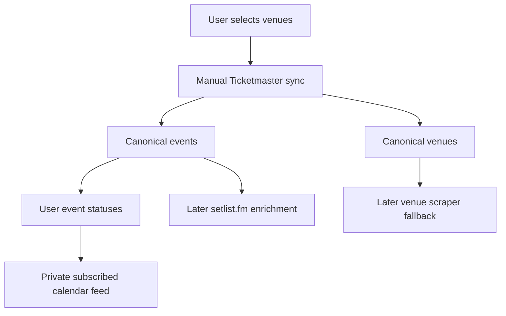

# Concert Tracker PRD and Technical Design

## Overview

Build the concert tracker into a durable, low-footgun feature for monitoring Denver-area shows at explicitly selected venues. The first production slice stores selected Ticketmaster venues, syncs upcoming Ticketmaster events for those venues, tracks per-user event statuses, and exposes a private subscribed calendar feed for interested and owned shows.

This is intentionally not a venue-scraping platform or setlist playlist generator yet. The foundation should make those later additions possible without mixing discovery, ownership, calendar, and enrichment concerns into one fragile blob.

## Goals

- [ ] Save canonical venues with `tmVenueId` so the user can choose exactly which venues matter.
- [ ] Store canonical Ticketmaster events with `tmEventId` so newly seen events can be identified over time.
- [ ] Track per-user event state separately from canonical event data.
- [ ] Let the user mark events as `new`, `interested`, `owned`, or `ignored`.
- [ ] Provide a private `.ics` feed URL that Google Calendar can subscribe to.
- [ ] Keep Ticketmaster usage bounded and explicit in the first version.

## Non-Goals

- [ ] No automatic cron sync in the first implementation slice.
- [ ] No venue schedule scraping in the first implementation slice.
- [ ] No setlist.fm integration in the first implementation slice.
- [ ] No Spotify playlist generation in the first implementation slice.
- [ ] No multi-user sharing, collaborative status, or public concert pages.

## Why This Work, In This Order



1. Venue selection comes first because broad location search is noisy and API-limited.
2. Canonical event storage comes second because `tmEventId` gives us durable new-event detection.
3. User statuses come after canonical events so personal state does not corrupt source data.
4. Calendar export follows statuses because the feed should include only events the user cares about.
5. Setlist.fm and venue scraping come later because they depend on reliable venues/events and matching.

## External API Constraints

### Ticketmaster Discovery API

**Decision**: Use Ticketmaster as the first structured event source, but only for selected venues and manual sync.

**Rationale**:
- Discovery API supports `venueId`, `postalCode`, `classificationName=music`, date sorting, and upcoming event search.
- The default quota is 5,000 calls/day and 5 requests/second.
- Deep paging only supports access up to about the first 1,000 results for a query.
- Documentation and observed behavior disagree on max page size; use `size=199` to stay under Ticketmaster's practical `200` rejection boundary.
- Ticketmaster postalCode search behaves like an exact ZIP filter; use `geoPoint` for the primary `80209` radius search so radius actually expands.
- Ticketmaster coverage will be incomplete for some venues, so later venue scraping remains likely.

### setlist.fm API

**Decision**: Defer setlist.fm integration.

**Rationale**:
- setlist.fm has API endpoints for artists, venues, and historical setlists.
- It does not provide an upcoming concerts API.
- It becomes useful after events and artist matching exist, for recent historical setlists or likely songs.
- The eventual playlist feature should be enrichment, not event discovery.

## Data Model

### `concertVenues`

Canonical venue rows deduped by Ticketmaster venue ID.

```typescript
concertVenues: defineTable({
	tmVenueId: v.string(),
	name: v.string(),
	city: v.optional(v.string()),
	stateCode: v.optional(v.string()),
	address: v.optional(v.string()),
	postalCode: v.optional(v.string()),
	latitude: v.optional(v.number()),
	longitude: v.optional(v.number()),
	firstSeenAt: v.number(),
	lastSeenAt: v.number(),
	lastFetchedAt: v.optional(v.number()),
})
	.index("by_tmVenueId", ["tmVenueId"])
	.index("by_name", ["name"])
```

### `userConcertVenues`

Per-user selected venue rows.

```typescript
userConcertVenues: defineTable({
	userId: v.string(),
	venueId: v.id("concertVenues"),
	isSelected: v.boolean(),
	label: v.optional(v.string()),
	createdAt: v.number(),
	updatedAt: v.number(),
})
	.index("by_userId", ["userId"])
	.index("by_userId_venueId", ["userId", "venueId"])
	.index("by_userId_isSelected", ["userId", "isSelected"])
```

### `concertEvents`

Canonical Ticketmaster event rows.

```typescript
concertEvents: defineTable({
	tmEventId: v.string(),
	venueId: v.id("concertVenues"),
	name: v.string(),
	url: v.optional(v.string()),
	imageUrl: v.optional(v.string()),
	localDate: v.optional(v.string()),
	localTime: v.optional(v.string()),
	dateTime: v.optional(v.string()),
	tmStatus: v.optional(v.string()),
	attractionNames: v.array(v.string()),
	firstSeenAt: v.number(),
	lastSeenAt: v.number(),
	lastFetchedAt: v.number(),
})
	.index("by_tmEventId", ["tmEventId"])
	.index("by_venueId", ["venueId"])
	.index("by_venueId_dateTime", ["venueId", "dateTime"])
	.index("by_dateTime", ["dateTime"])
```

### `userConcertEvents`

Per-user event overlay. This is where personal state lives.

```typescript
userConcertEvents: defineTable({
	userId: v.string(),
	eventId: v.id("concertEvents"),
	userStatus: v.union(
		v.literal("new"),
		v.literal("interested"),
		v.literal("owned"),
		v.literal("ignored"),
	),
	notes: v.optional(v.string()),
	firstSeenAt: v.number(),
	updatedAt: v.number(),
})
	.index("by_userId", ["userId"])
	.index("by_userId_eventId", ["userId", "eventId"])
	.index("by_userId_userStatus", ["userId", "userStatus"])
```

### `concertCalendarFeeds`

Private feed token rows. Calendar apps cannot rely on the app session cookie.

```typescript
concertCalendarFeeds: defineTable({
	userId: v.string(),
	token: v.string(),
	createdAt: v.number(),
	updatedAt: v.number(),
	revokedAt: v.optional(v.number()),
})
	.index("by_userId", ["userId"])
	.index("by_token", ["token"])
```

## Product Behavior

## Phase 1: Venue Selection Foundation

**Goal**: Save exact venues from Ticketmaster results.

**Why First**: Venue choice defines the sync boundary and prevents broad-location polling from becoming noisy or expensive.

### User Stories

- [ ] **US1.1**: As a user, I can search around `80209` and see venues found from Ticketmaster music events.
- [ ] **US1.2**: As a user, I can save a venue so future syncs target that exact `tmVenueId`.
- [ ] **US1.3**: As a user, I can unselect a venue without deleting historical events.

### Acceptance Criteria

- [ ] Saved venues persist in Convex with `tmVenueId`.
- [ ] Selecting the same venue twice updates the existing row rather than creating duplicates.
- [ ] Unselecting a venue excludes it from future manual syncs.
- [ ] The concerts page is behind login middleware.

## Phase 2: Manual Event Sync

**Goal**: Fetch and store upcoming events for selected venues.

**Why Second**: New-event detection requires persisted canonical events.

### User Stories

- [ ] **US2.1**: As a user, I can manually sync all selected venues.
- [ ] **US2.2**: As a user, I can see how many events were new versus already known.
- [ ] **US2.3**: As a user, I can see upcoming events sorted by date.

### Acceptance Criteria

- [ ] Sync uses Ticketmaster `venueId` queries, not broad postal search.
- [ ] Sync uses bounded paging with a hard request cap.
- [ ] Existing `tmEventId` rows are patched, not duplicated.
- [ ] New events create `userConcertEvents` rows with `userStatus: "new"`.
- [ ] Manual sync surfaces counts for inserted, updated, and failed venues.

## Phase 3: Event Status Tracking

**Goal**: Track interest and ticket ownership.

**Why Third**: Status is meaningful only after events are stable records.

### User Stories

- [ ] **US3.1**: As a user, I can mark a show as interested.
- [ ] **US3.2**: As a user, I can mark a show as owned when I have tickets.
- [ ] **US3.3**: As a user, I can ignore a show so it does not clutter my working view.

### Acceptance Criteria

- [ ] Status updates only patch `userConcertEvents`.
- [ ] Ignored events remain stored but can be hidden by default.
- [ ] Interested and owned events are visually distinct.
- [ ] Status changes are reflected without requiring a new Ticketmaster sync.

## Phase 4: Private Calendar Feed

**Goal**: Provide a subscribed `.ics` feed for Google Calendar.

**Why Fourth**: Calendar output should depend on user-curated event state, not raw discovery.

### User Stories

- [ ] **US4.1**: As a user, I can copy a private calendar feed URL.
- [ ] **US4.2**: As a user, I can subscribe to the feed in Google Calendar.
- [ ] **US4.3**: As a user, I can regenerate the feed token if it leaks.

### Acceptance Criteria

- [ ] Feed validates `?token=` against Convex.
- [ ] Feed includes only `interested` and `owned` events.
- [ ] Calendar titles are prefixed with `[Interested]` or `[Owned]`.
- [ ] Event `UID` values are stable and based on `tmEventId`.
- [ ] iCalendar text escaping handles commas, semicolons, backslashes, and newlines.
- [ ] The feed returns `text/calendar; charset=utf-8`.

## Error Handling

- [ ] Missing `TICKETMASTER_API_KEY` returns a clear setup error.
- [ ] Ticketmaster failures are reported per venue during manual sync.
- [ ] The UI should keep already synced data visible if a new sync fails.
- [ ] Calendar token failure returns `401`, not a redirect to login.
- [ ] Invalid status transitions are rejected by Convex argument validation.

## Testing Strategy

- [ ] Unit-test Ticketmaster normalization with representative event and venue payloads.
- [ ] Unit-test iCalendar escaping and event rendering.
- [ ] Typecheck Convex schemas/functions and Next routes with `pnpm typecheck`.
- [ ] Run scoped Biome checks for changed files.
- [ ] Do not use full `pnpm check` as the completion gate until unrelated existing generated/Convex diagnostics are fixed.

## Later Phases

### Venue Schedule Scraping

Use scraping only for selected important venues where Ticketmaster misses events. Scraped events should either map to canonical events by source-specific ID or enter a separate source table before being merged.

### Artist Matching

Start with normalized string matching between Ticketmaster attraction names and local artist/Spotify data. Do not introduce fuzzy matching until false positives are understood.

### setlist.fm Enrichment

After artist matching exists, use setlist.fm for historical setlists by artist or venue. Store setlist source data separately, then derive candidate songs for upcoming interested or owned events.

### Upcoming Events Playlist

After setlist enrichment exists, create or update a Spotify playlist from likely setlist songs. This should be a separate explicit action before any automation.

## Open Questions

- [ ] Should `owned` events include seat/order metadata now, or should that wait until the basic calendar feed is working?
- [ ] Should the calendar feed include all-day events when Ticketmaster provides a date but no time?
- [ ] Should ignored events be hidden forever by default, or shown in a separate archive filter?
