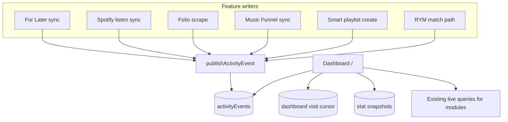

# Personal Dashboard Design

## Goal

Replace the authenticated `/` home link grid with a personal dashboard that answers: **what’s been happening recently**, with deep links into the features that matter most day to day.

This is informed by a usage interview (2026-07-16): For Later, album History/Rankings, occasional Folio announcements, and a desire for recent tracks + one-click recommendations — not Tracks-as-a-page, not Folio browsing/eBay tools.

## Product Shape

### Route

- Authenticated `/` → personal dashboard
- Unauthenticated `/` → keep a simple public/login landing (Rob’s Top 50 + sign-in prompt); do not require auth to view the public landing

### Layout priority

1. **What’s been happening** — paginated activity timeline (primary)
2. **Recently listened albums** — short list with inline rating (primary)
3. Compact modules: **Recommend**, **Latest For Later**, **Recent tracks**, **Latest Folio**
4. **Collection stats** — current totals + compact 7/30/90 sparklines

### Explicitly out of v1

- Separate “Action these things” section (rating lives on recent albums; recommend is a button)
- Ranking backlog / “albums waiting for ranking” module
- Backfilling the activity timeline from historical sync runs (empty launch is fine)
- Birthdays module (idea still open elsewhere; not selected for v1)
- Genre listening charts as a primary module (stats are collection totals + sparklines)
- Storing URLs on events (`href`); use a feature key instead

## Activity Events Model

### Table: `activityEvents`

Durable, append-only summary rows written when meaningful batches complete.

Conceptual fields:

| Field | Purpose |
|-------|---------|
| `userId` | Owner |
| `type` | Event kind (literal union) |
| `feature` | Feature key string the client maps to a route |
| `occurredAt` | When the batch finished |
| `title` | Short label, e.g. “For Later sync” |
| `summary` | Optional one-line human summary |
| `counts` | Optional structured counts, e.g. `{ added: 7, removed: 2 }` |
| `metadata` | Optional small JSON for display / tighter client routing (not a full item dump) |

Indexes (minimum):

- `by_userId_occurredAt` — timeline pagination newest-first

### Feature keys

Backend stores a typed feature string. The dashboard client owns the map to routes, for example:

| `feature` | Client route |
|-----------|--------------|
| `for_later` | `/for-later-albums` |
| `albums` | `/albums/history` (or `/albums` redirect) |
| `folio` | `/folio-society` |
| `music_funnel` | `/music-funnel` (existing funnel route) |
| `smart_playlists` | `/smart-playlists` |
| `rym` | `/albums/all` (library RYM triage) |

Optional query params (filters, run ids) may be derived from `metadata` on the client later; v1 can deep-link to the feature root.

### v1 event types

Publish going forward only (no historical backfill):

1. For Later sync completed  
2. Listening-history (Spotify recently-played) sync completed  
3. Folio scrape / new-releases batch  
4. Music Funnel playlist sync (run-level summary)  
5. Smart playlist created  
6. New RYM scrape match(es) (batch or per meaningful match group)

Each type maps to a `feature` key above.

### Publishing rules

- Call a shared helper (e.g. `publishActivityEvent`) from existing success paths after the source work commits
- If event publish fails, **do not fail the source sync/create**; log and continue
- Prefer one summary row per batch, not one row per album/track

### Click behavior

Timeline row navigates via the client feature→route map. No expand/drawer for event details in v1.

## New Since Last Visit

Server-side visit cursor (not Music Funnel localStorage):

- Store `dashboardLastVisitedAt` on a small user prefs doc, or a dedicated `dashboardVisits` row keyed by `userId`
- Dashboard load flow:
  1. Query returns timeline using **previous** `dashboardLastVisitedAt`
  2. Events with `occurredAt > previousVisitAt` render with a “new” badge for that page load
  3. Mutation records the new visit timestamp (on open)

Empty timeline at launch is acceptable; “new” badges appear once events exist and the user returns.

## Supporting Modules

### Recently listened albums (primary)

- Last ~5–10 albums from existing listen history (`userAlbums` / listen queries already used by History)
- Inline rating using existing `AlbumRatingDrawer` / rating patterns
- Deep-link to `/albums/history`

### Recommend

- Button/card that opens the existing For Later recommendation drawer/modal flow
- No new recommendation algorithm in this project

### Latest For Later

- Small preview of newest For Later albums (by `lastSeenAt` / `firstSeenAt`)
- Deep-link to `/for-later-albums`

### Recent tracks

- Last few tracks from recently played (`getRecentlyPlayedTracks` / `userTracks`)
- Deep-link to `/albums/tracks` (surface exists even if rarely used as a destination today)

### Latest Folio

- Last few releases by `firstSeenAt`
- Deep-link to `/folio-society`
- Folio has no sync-run table today — publishing a Folio activity event requires adding a publish call at the end of the Folio sync/scrape success path (and may introduce a lightweight sync summary if counts are needed)

### Collection stats + sparklines

Metrics (current totals + trend series):

- Total albums saved  
- Total For Later  
- Total Folio books  
- Total funnel tracks  
- Repeat tracks  
- Total smart playlists  

UI: compact cards with **current total**, optional short delta, and **tiny 7/30/90 sparklines** (not full charts).

Snapshot strategy (implementation detail in plan): prefer a light daily rollup table (e.g. `dashboardStatSnapshots`) written by cron or on-demand lazy snapshot, rather than recomputing full history on every dashboard load. Exact metric definitions (what counts as “albums saved”, “repeat tracks”) must be pinned in the plan against existing schema fields.

## Architecture

### Frontend structure (suggested)

- Replace authenticated content of `src/app/page.tsx` with a client dashboard shell (or colocated `_components/`)
- Components roughly: `DashboardTimeline`, `DashboardRecentAlbums`, `DashboardRecommendButton`, `DashboardForLaterPreview`, `DashboardRecentTracks`, `DashboardFolioPreview`, `DashboardStatCards`
- Keep feature→route mapping in one module (e.g. `src/app/_utils/dashboard-feature-routes.ts`)

### Backend structure (suggested)

- `convex/schema.ts` — `activityEvents`, visit cursor, optional `dashboardStatSnapshots`
- `convex/dashboard.ts` (or `activityEvents.ts`) — list timeline, record visit, read stats
- `convex/_utils/activityEvents.ts` — `publishActivityEvent` helper
- Wire publish calls into For Later sync save, Spotify sync run save, Folio sync success, Music Funnel run completion, smart playlist create, RYM match success paths

## Empty States

- Timeline: “Activity will appear here as syncs and updates happen.”
- Supporting modules may still show current live data even when the timeline is empty
- Stats cards show current totals; sparklines empty/flat until snapshots accumulate

## Success Criteria

- Authenticated `/` is the dashboard, not the old link grid
- Timeline paginates `activityEvents` newest-first; rows deep-link by `feature`
- New badges use server visit cursor updated on open
- Recent albums support rating without leaving the dashboard
- Recommend opens the existing For Later recommendation flow
- Compact For Later / tracks / Folio previews deep-link correctly
- Stat cards show totals + sparkline trends for the agreed metrics
- Source syncs/creates never fail solely because activity publish failed
- No historical timeline backfill required for launch

## Testing Notes

- Unit/source tests for feature→route map and event type validators
- Source tests that each publish call site invokes `publishActivityEvent` (or shared helper) after success
- Manual: open `/` after a For Later sync → event appears; reopen → marked seen; recommend modal opens; rate an album from recent listens
