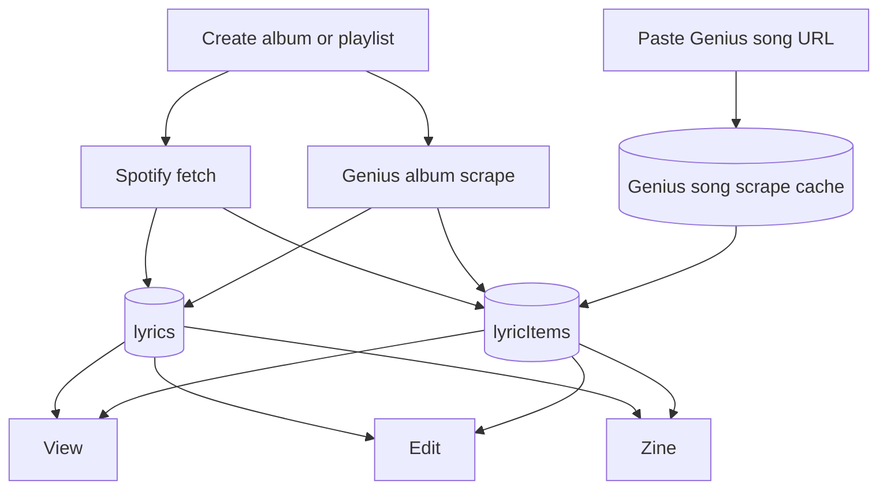

# Unify Lyrics into a Singular Lyric Concept

**Date:** 2026-07-17  
**Status:** Approved design  
**Idea:** `docs/ideas/2026-07-15-unify-lyrics-into-singular-lyric-concept.md`

## Goal

Make **one** lyric concept with types (`album` | `playlist`): one list, one create flow, shared view / edit / zine. New work uses this model only. Legacy album and playlist lyrics stacks stay as-is — no migration, no redirects.

## Background

Today there are two parallel stacks:

| Stack | Routes | Tables |
|-------|--------|--------|
| Album | `/lyrics`, `/lyrics/[slug]/{edit,zine}` | `geniusAlbums`, `geniusSongs` |
| Playlist | `/lyrics/playlists`, `/playlist-lyrics/[slug]/{edit,zine}` | `playlistLyrics`, `playlistLyricsItems`, `geniusLyricScrapes` |

Zine/print rendering is already shared (`src/lib/zine/`, `src/components/zine/`). The remaining split is the data model, list/create/edit/reader surfaces, and per-source Convex CRUD.

This project introduces a **new standard** alongside the old stacks. Old pages keep reading old tables until they are abandoned later.

## Product Shape

### Routes (new standard)

| Surface | Path |
|---------|------|
| List | `/lyrics` |
| View / reader | `/lyrics/[slug]` |
| Edit | `/lyrics/[slug]/edit` |
| Zine | `/lyrics/[slug]/zine` |
| Public | `/public/lyrics/...` (new model only) |

List shows both album and playlist types in one feed (filter tabs optional later; not required for v1).

### Cross-page navigation

From **any** of view / edit / zine for a lyric, always offer clear links to the other two (View, Edit, Zine). You should never be stuck without a path to edit or zine from the page you are on.

### Create entry

One create flow:

1. Choose **album** or **playlist**
2. Paste Spotify album or playlist link (required)
3. Album only: also paste Genius album URL

Create UI chrome (page / panel / modal / drawer) is an implementation detail; behavior above is fixed.

### Legacy

- Do **not** migrate `geniusAlbums` / `geniusSongs` / `playlistLyrics` / `playlistLyricsItems`
- Do **not** add redirects from `/playlist-lyrics/*` or old public paths
- New UI and APIs only read/write the unified tables
- Old routes may keep working on old tables until removed in a separate effort

## Data Model

### `lyrics` (collection)

Conceptual fields:

| Field | Purpose |
|-------|---------|
| `type` | `album` \| `playlist` |
| `slug` | URL key |
| `title` | Display title |
| Shared zine/cover fields | Same family as today’s duplicated `zine*` collection fields |
| `spotifyAlbumId` / `spotifyPlaylistId` | Whichever applies; always stored when provided so Spotify can be rescraped later |
| Cached Spotify metadata | Art, year, and other supplementary fields as needed |
| Album: Genius album URL / scrape identity | Album bulk-scrape source |
| Timestamps | `createdAt`, `updatedAt`, etc. |

Optional playlist workflow fields (e.g. draft/ready) may live on the same document if still useful; do not invent a second collection type.

### `lyricItems` (ordered tracks)

| Field | Purpose |
|-------|---------|
| `lyricsId` | Parent collection |
| `position` | Order |
| Spotify-derived fields | Title, artist, album art, duration (especially authoritative for **playlist** type) |
| Genius-derived fields | Lyrics body, credits (when a Genius URL has been scraped) |
| Shared per-item zine / override fields | Mirror today’s shared item-level zine columns |
| Genius scrape link or scrape-cache id | When present |
| `sourceState` | Track readiness (see below) |

### Source state (per item)

Exact literal names can be finalized in the plan; behavior:

| State | Meaning |
|-------|---------|
| Pending Genius | Seeded (playlist) or waiting; no lyrics yet |
| Ready | Genius scraped; lyrics/credits available |
| Instrumental | Marked instrumental; no Genius expected |
| Not on Genius | Explicitly marked not on Genius |
| Failed | Scrape attempted and failed; retryable |

### Genius song scrape cache

Reuse or parallel a Genius song scrape cache (like today’s `geniusLyricScrapes`) so the same Genius song URL is not blindly re-fetched.

### Source-of-truth rules

**Album**

- **Genius** is source of truth for the **track list** and lyrics/credits
- **Spotify** is supplementary: year, album art, and anything else we choose later
- Always persist `spotifyAlbumId` for rescrape
- Spotify must **not** add/remove tracks relative to the Genius album scrape

**Playlist**

- **Spotify** is source of truth for title, artist, album art, duration, and order (from the seed)
- **Genius** supplies lyrics and credits only after the user pastes a Genius song URL
- Always persist `spotifyPlaylistId` for rescrape

## Create & Edit Flows

### Album after create

1. Scrape Genius album → create `lyricItems` from Genius tracks + lyrics
2. Fetch Spotify album by id → attach year, art, other supplementary metadata; store `spotifyAlbumId`
3. Land on edit or view with tracks populated

### Playlist after create

1. Fetch Spotify playlist → seed `lyricItems` (Spotify title/artist/art/duration/order; no lyrics yet)
2. Store `spotifyPlaylistId`
3. Land on **edit**: each row waits for either
   - a pasted Genius song URL → scrape lyrics/credits, or
   - **Instrumental** / **Not on Genius** action

No automatic Genius matching for playlist tracks in v1.

### Edit

- One shared editor for both types
- Type-specific chrome only where needed:
  - Album: Genius/Spotify identity, rescrape affordances later
  - Playlist: per-track Genius paste + Instrumental / Not on Genius
- Reorder, hide, credit overrides: keep existing useful behaviors where they still apply to the unified model

### View / Zine

- Shared reader + existing shared zine shell (`LyricsZine`), adapted from unified `lyrics` / `lyricItems`
- Playlist items that are still pending may be skipped or shown as placeholders in view/zine until ready / instrumental / not on Genius
- Cross-links: View ↔ Edit ↔ Zine on every surface

## Architecture

### Backend (suggested)

- New Convex module(s) for unified CRUD + create pipelines (e.g. `convex/lyrics.ts`)
- Shared zine mutations keyed by unified ids (do not extend the old mirror APIs for new work)
- Actions for Spotify playlist/album fetch and Genius album/song scrape as needed

### Frontend (suggested)

- Unified list/create on `/lyrics`
- Shared `[slug]` view / edit / zine pages with a persistent View | Edit | Zine nav
- Thin zine adapter mapping unified rows → `ZineSongDisplayInput` (same pattern as today’s album/playlist adapters)

## Error Handling

| Case | Behavior |
|------|----------|
| Spotify fetch fails on create | Fail clearly; do not leave a silent half-created collection without an edit path |
| Genius album scrape fails | Keep draft if Spotify already saved; surface error; allow retry |
| Genius song scrape fails on a playlist item | Mark item failed; keep Spotify metadata; allow retry |
| View/zine with pending playlist items | Skip or placeholder; do not crash |
| Legacy pages | Unaffected; still use old tables |

## Out of Scope

- Migrating old `geniusAlbums` / `playlistLyrics` data into the unified model
- Redirects from `/playlist-lyrics/*` or old public URLs
- Auto-matching Genius URLs for Spotify playlist tracks
- Deleting or rewriting the old stacks in this project
- Changing the shared zine layout/print engine beyond a new adapter

## Success Criteria

- New lyrics are created only through the unified album/playlist create flow
- One list at `/lyrics` shows new-standard lyrics of both types
- View, Edit, and Zine are always reachable from each other for a lyric
- Album: Genius defines tracks; Spotify contributes art/year; `spotifyAlbumId` stored
- Playlist: Spotify defines track metadata; Genius only fills lyrics/credits after paste; Instrumental / Not on Genius available
- Zine uses the existing shared renderer via a unified adapter
- Legacy album/playlist pages remain functional on old tables without migration

## Testing Notes

- Unit/source tests for source-of-truth mapping (album Genius tracks vs Spotify metadata; playlist Spotify seed vs Genius lyrics patch)
- Create flow tests: album requires both links; playlist seeds pending items
- Manual: create album + playlist; navigate View ↔ Edit ↔ Zine; paste Genius on playlist tracks; mark instrumental / not on Genius; confirm old `/playlist-lyrics` still works unchanged
