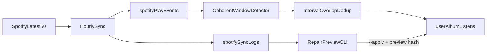

# Durable Spotify Album Listen Capture

**Date:** 2026-07-19  
**Status:** Draft — awaiting user review  
**Trigger:** Production miss — YEARNALISM (Baby Rose) full morning re-listen not recorded despite Tracks UI showing all 12 tracks.

## Goal

Capture album listens reliably when the same album is re-listened often, without changing the listen definition users already rely on.

Success means:

1. A clean ≥70% ordered listen within four hours is recorded even when older plays for the same album sit in the same Spotify snapshot.
2. Sessions that span sync boundaries still qualify.
3. Frequent re-listens do not silently drop behind Spotify’s 50-event recently-played cap.
4. Historical gaps can be inspected safely and backfilled only after an explicit, hash-gated apply.

## Problem

### What broke YEARNALISM

Sync polls Spotify `GET /me/player/recently-played?limit=50` (latest page only; deeper paging is empty in practice). Detection groups every play for an album ID from that single batch, then requires ≥70% unique tracks, ≥70% ascending pairs, and a ≤4h span.

The morning listen was a clean `#1–#12` sequence (~14:43–15:21 UTC). The same batch also contained stale plays (`#10` previous evening, `#8` earlier that day). The restart split rule (`prev ≥ ceil(0.7×N)` AND `curr ≤ 3`) did not fire for `#8 → #1` because `8 < 9`. One mega-session spanned ~18 hours, failed the 4h cap, and recorded zero listens.

### Why the UI looked fine

`userTracks` stores only the latest `lastPlayedAt` per track. The Tracks page groups by album name over recent rows, so it can show a complete album while detection still sees multi-play raw events that fail together.

### Systemic gaps

- No per-play ledger — only lossy `userTracks` plus raw `spotifySyncLogs` blobs that are never replayed for detection.
- Detection validates whole album buckets from one snapshot; stale plays poison valid fresh sequences.
- `moose` cron runs every 3 hours externally; Spotify’s history is capped at 50 events, so dense listening can drop plays between polls.
- Existing overlap dedup on `userAlbumListens` was not the failure mode for this miss.

## Non-goals

- Changing the listen rule away from ≥70% coverage / ≥70% order / 4-hour window.
- Building a Spotify currently-playing / Webhook / Always Listening live streamer.
- Auto-applying historical repair on deploy or cron.
- Mutating or deleting existing `userAlbumListens` rows during repair.
- Adding a duplicate Spotify cron in `vercel.json` (external scheduler remains source of truth).
- Fixing Tracks UI grouping semantics beyond what the ledger naturally enables later.

## Approach (chosen)

**Play-event ledger + coherent window detector + hourly poll + preview-first repair.**

Alternatives considered and rejected for this scope:

| Approach | Why not now |
| --- | --- |
| Detector-only (split/windowing on current 50) | Fixes YEARNALISM-class bugs but still loses history under heavy listening and cannot repair the past from a durable event store. |
| Currently-playing / live poller | Higher complexity and ops cost; overlaps poorly with recently-played semantics; not needed if ledger + hourly coverage is enough. |

## Architecture

### Components

1. **`spotifyPlayEvents` ledger** — idempotent storage of every observed play.
2. **Coherent window detector** — same thresholds; smarter attempt/window selection.
3. **Sync integration** — ingest latest 50 → detect from rolling ledger around the snapshot → record listens.
4. **Repair tooling** — rebuild candidates from historical raw logs; dry-run by default.

## Listen definition (unchanged)

A qualifying album listen requires:

- Unique track coverage ≥ **70%** of the album’s track count.
- Ordered transitions ≥ **70%** of consecutive pairs in the selected window (ascending track number; disc-aware).
- Wall-clock span from first to last play in the window ≤ **4 hours**.

Auto-recorded listens use the session’s actual end time (`latestPlayedAt`) as `listenedAt`. Interval-overlap deduplication against existing `userAlbumListens` remains the uniqueness gate for automatic writes.

## Detector redesign

Preserve the public thresholds; change how candidates are carved from play sequences.

### Attempt splitting

Sort plays by `playedAt`, then by `(discNumber, trackNumber)`. Split into a new attempt when `(discNumber, trackNumber)` goes **backward** and the landing track is in the first **30%** of the album (`trackNumber ≤ ceil(0.3 × albumTrackCount)`, disc 1). Example: on a 12-track album, `#8 → #1` splits (`1 ≤ 4`); `#11 → #5` does not.

### Window selection

Within each attempt, do **not** accept/reject the entire attempt blindly. Select the strongest contiguous window that satisfies the listen definition. Deterministic score order:

1. Higher unique-track coverage
2. Higher ordered-transition ratio
3. Shorter wall-clock span

### Disc awareness

Include Spotify `disc_number` in ordering so disc boundaries do not look like album restarts or shuffle.

### Regression coverage (required)

`src/lib/album-detection.test.ts` must cover at least:

- Exact YEARNALISM production sequence (stale `#10` / `#8` + clean morning `#1–#12`)
- Stale duplicate tracks in the same bucket
- Partial attempt followed by a full qualifying listen
- Consecutive re-listens of the same album
- 70% coverage and order boundaries (just below / at / above)
- Shuffle rejection
- Four-hour span rejection
- Multi-disc ordered playback

## Play-event ledger

### Schema: `spotifyPlayEvents`

One document per observed play. Event identity is derived from `(userId, spotifyTrackId, playedAt)` so repeated cron/manual snapshots are idempotent.

Minimum fields:

- `userId`
- `spotifyTrackId`
- `spotifyAlbumId`
- `trackNumber`
- `discNumber`
- `playedAt` (ms)
- `eventKey` (stable hash/string of the identity tuple)
- `ingestedAt` (ms)
- `syncRunId` (optional link to the ingesting sync run)

Indexes:

- by user + `playedAt`
- by user + album + `playedAt`
- by user + `eventKey` (unique lookup for upsert)

### Ingestion

During each Spotify sync:

1. Fetch latest 50 recently-played items (no reliance on empty deeper pages).
2. Upsert into `spotifyPlayEvents` (insert new; skip duplicates).
3. Continue upserting `userTracks` for UI/recents as today.
4. Persist raw sync payload to `spotifySyncLogs` as today (repair evidence).

### Detection input

Run the detector against ledger events for albums touched by the current snapshot, looking back **24 hours** from the newest play in that snapshot (covers cross-boundary and in-progress sessions; not only the 50 HTTP items).

Diagnostics to record on the sync run:

- inserted vs duplicate event counts
- candidate listens vs listens written after overlap dedup
- warning when a full 50-item batch has **no** overlap with the prior watermark (possible history loss between polls)

## Sync and scheduling

- Keep the existing route `src/pages/api/cron/sync-spotify.ts`.
- Do **not** add a Spotify cron to `vercel.json`.
- Move external `moose` schedule from every **3 hours** to **hourly** (match `robert`).
- Label cron vs manual sync sources accurately in run metadata.

Hourly polling plus idempotent overlap is the intended defense against the 50-event cap. Overflow warnings surface residual risk when listening is denser than ~50 plays/hour.

## Historical repair

### Purpose

Recover listens missed before the ledger/detector fix, using `spotifySyncLogs` (and later the ledger when present) as evidence.

### Preview-first CLI

`scripts/repair-spotify-album-listens.ts` (plus package script):

- **Default:** dry-run / preview only.
- Print each candidate: stable candidate id, user, album, play window, coverage, order ratio, evidence pointers, and a deterministic **preview hash** of the full candidate set.
- Never write listens in default mode.

### Explicit apply

Apply is a separate invocation that requires **all** of:

1. `--apply`
2. Matching `--preview-hash` from the latest preview
3. Either selected candidate IDs **or** an explicit `--all`

Before writing, recompute the candidate set. If the hash drifts, abort with no writes.

### Apply semantics

- Insert missing `userAlbumListens` that do not overlap existing rows.
- Never modify or delete existing listen rows.
- Never run from deploy hooks or normal sync.
- Prefer pure candidate generation in `src/lib/spotify-listen-repair.ts` with unit tests; Convex helpers only for paginated reads/writes.

## Data flow (forward path)

1. Hourly (or manual) sync fetches Spotify’s latest 50 plays.
2. Events upsert into `spotifyPlayEvents`; raw blob logged.
3. Detector loads rolling ledger events, splits attempts, picks best valid windows.
4. Overlap dedup against existing listens.
5. Qualifying listens written to `userAlbumListens` with `listenedAt = session end`.

## Error handling and diagnostics

- Duplicate event ingestion is success (no-op), not an error.
- Detector producing zero candidates is normal when coverage/order/span fail.
- Overlap skip is normal when the listen was already recorded.
- Full-batch watermark miss logs a clear warning for ops review.
- Repair apply abort on hash mismatch is expected when Spotify/logs changed between preview and apply.

## Testing strategy

1. Unit tests for detector (required regressions above).
2. Unit tests for repair candidate generation (dedupe across logs, exclude overlaps, stable hashing).
3. Focused Node test run, then `pnpm typecheck` and `pnpm check`.
4. Production preview for `moose`: confirm YEARNALISM morning window appears as a candidate; **stop until explicit approval to apply**.

## Rollout

1. Ship detector + ledger + sync integration.
2. Change `moose` external cron to hourly; verify `spotifySyncRuns` cadence and diagnostics.
3. Run repair **preview** in production; review candidates.
4. Apply only after human approval with hash + selected IDs or `--all`.

## Out of scope follow-ups

- Tracks UI that distinguishes multi-listen days using the ledger.
- Retention / compaction policy for very old `spotifyPlayEvents`.
- Live currently-playing capture if hourly + 50 still proves insufficient.

## File touch list (expected)

- `src/lib/album-detection.ts` / `src/lib/album-detection.test.ts`
- `src/lib/spotify.ts` (disc metadata on types)
- `src/lib/spotify-sync.ts`
- `src/lib/spotify-listen-repair.ts` / `.test.ts`
- `convex/schema.ts`
- `convex/spotifyPlayEvents.ts`
- `convex/spotifyListenRepair.ts`
- `convex/spotify.ts` (dedup / record path as needed)
- `scripts/repair-spotify-album-listens.ts`
- package scripts; external cron config (ops, not repo)
)
